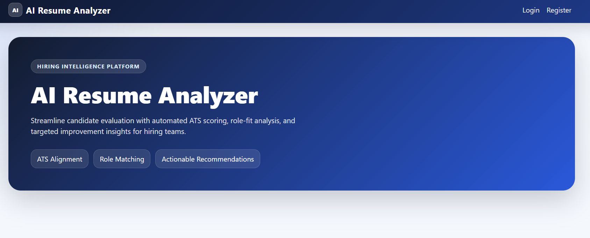
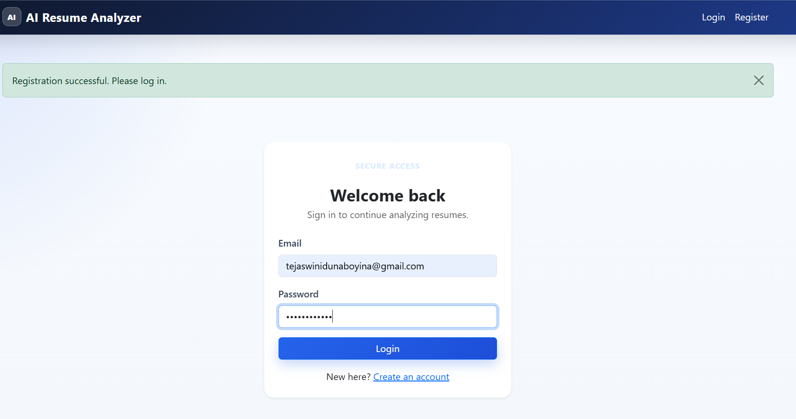
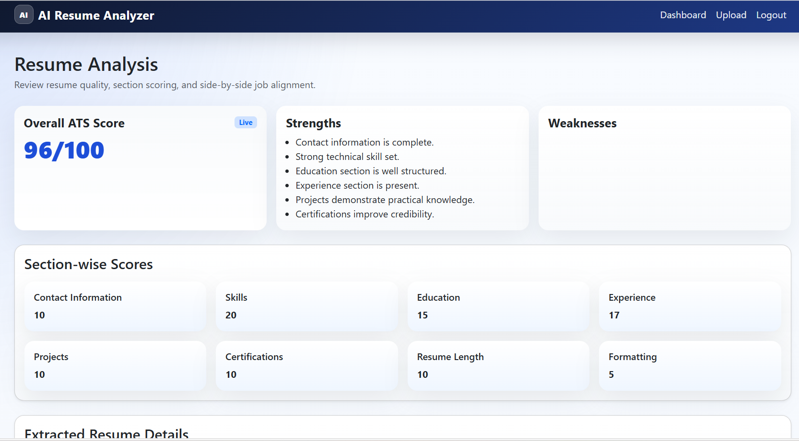

# AI Resume Analyzer

An AI-powered Resume Analyzer web application built using **Flask**, **Python**, **MySQL**, and **SQLAlchemy**. The application helps users analyze their resumes using ATS-style scoring, extract resume details, and compare resumes against job descriptions to identify matching and missing skills.

---

## Features

- 🔐 User Authentication (Register & Login)
- 📄 Upload Resume (PDF)
- 📊 ATS Resume Score
- 📝 Resume Parsing
  - Name
  - Email
  - Phone Number
  - Skills
  - Education
  - Experience
  - Projects
  - Certifications
- 🎯 Job Description Matching
- 📈 Section-wise Resume Analysis
- 💡 Resume Improvement Suggestions
- 📂 Resume History
- 💻 Responsive Dashboard

---

## Tech Stack

### Backend
- Python
- Flask
- SQLAlchemy
- Flask-Login

### Database
- MySQL

### Frontend
- HTML
- CSS
- Bootstrap 5
- JavaScript
- Jinja2 Templates

### Libraries
- PyPDF2
- python-dotenv

---

## Project Structure

```
AI-Resume-Analyzer/
│
├── app.py
├── config.py
├── requirements.txt
├── README.md
│
├── models/
├── routes/
├── services/
├── templates/
├── static/
├── utils/
```

---

## Installation

### 1. Clone the repository

```bash
git clone https://github.com/Tejaswini462/AI-Resume-Analyzer.git
cd AI-Resume-Analyzer
```

### 2. Create a Virtual Environment

```bash
python -m venv .venv
```

### 3. Activate the Virtual Environment

Windows

```bash
.\.venv\Scripts\activate
```

Linux / macOS

```bash
source .venv/bin/activate
```

### 4. Install Dependencies

```bash
pip install -r requirements.txt
```

### 5. Configure Database

Create a `.env` file and add your MySQL configuration.

Example:

```env
MYSQL_HOST=localhost
MYSQL_USER=root
MYSQL_PASSWORD=your_password
MYSQL_DB=resume_analyzer
SECRET_KEY=your_secret_key
```

### 6. Run the Application

```bash
python app.py
```

---

## Screenshots

--Home Page--

 ---
 --Login Page--
 
 ---
 --Resume Analysis--
 

## Future Enhancements

- AI-powered resume suggestions using LLMs
- Resume PDF report generation
- LinkedIn profile analysis
- Skill recommendation engine
- Resume keyword optimization

---

## Author

**Dunaboyina Tejaswini**

B.Tech (AI & ML)

Vishnu Institute of Technology

---

## License

This project is developed for educational and placement purposes.